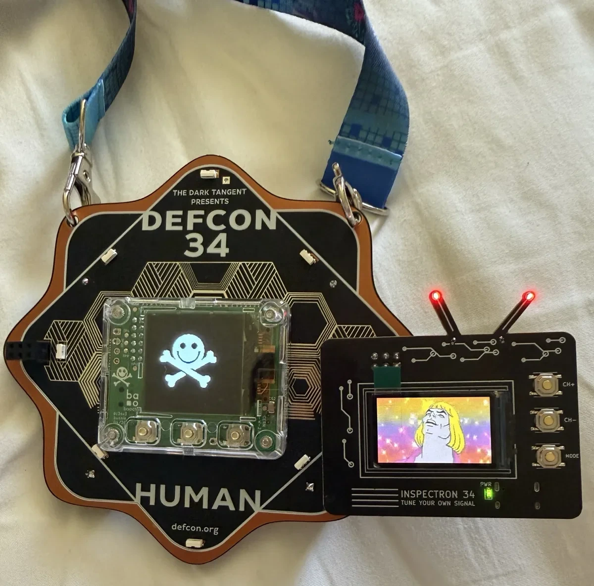
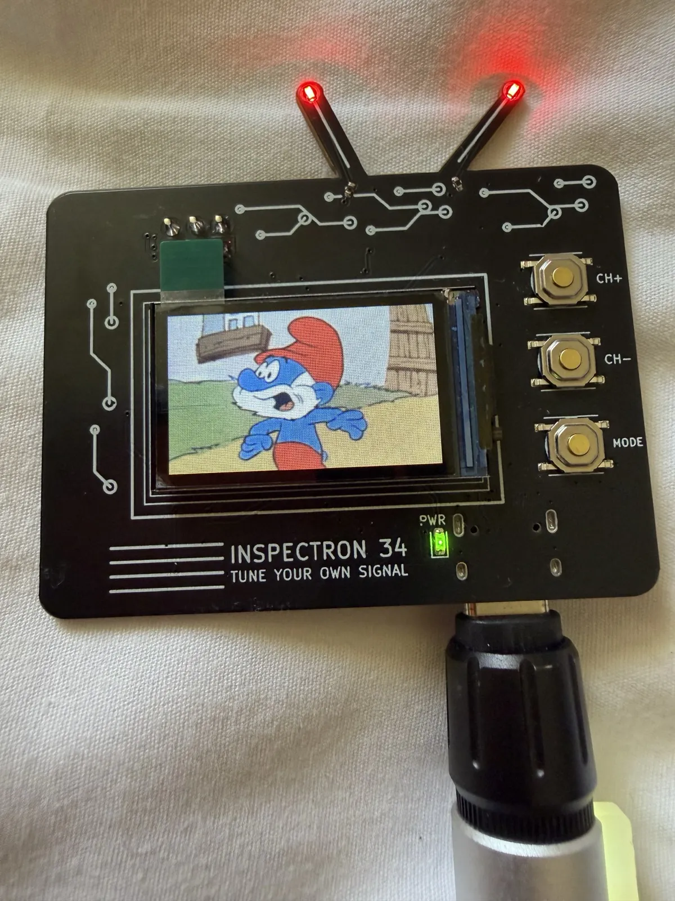
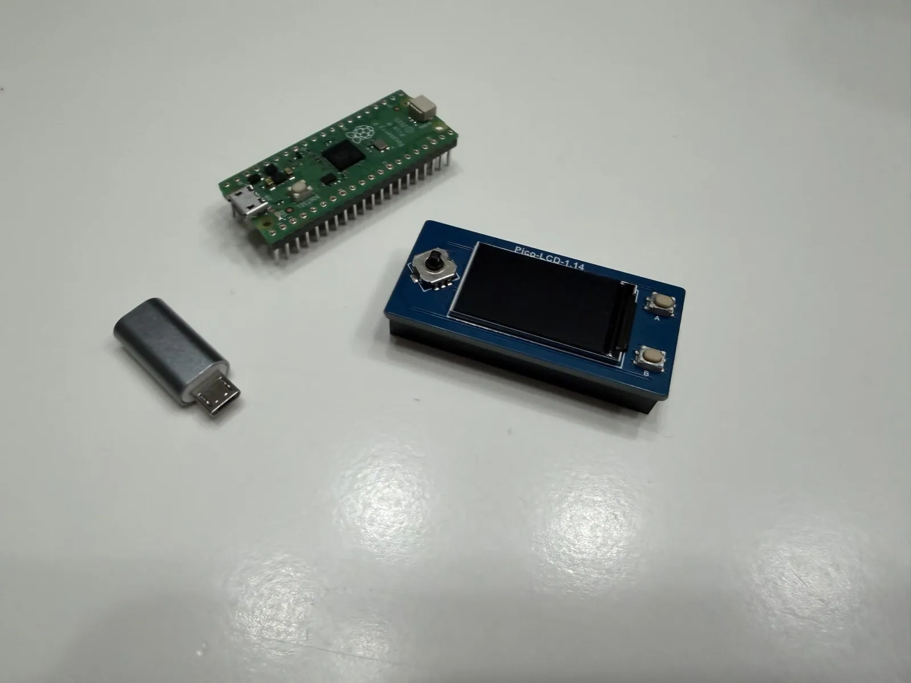
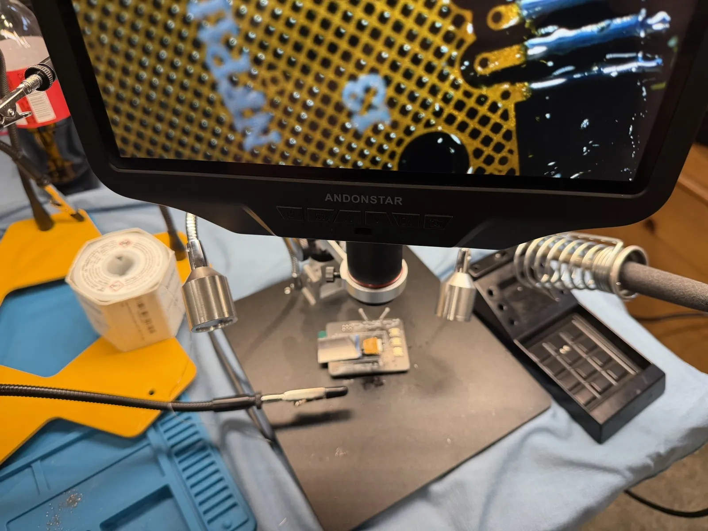

# INSPECTRON 34 — DC34 Meme TV SAO 📺

A DEF CON 34 Simple Add-On shaped like a retro CRT television that plays
looping meme GIFs on a 1.14" color IPS screen as TV *channels* — and hides
a puzzle game. Mount it as a USB drive and drag your own GIFs on. Channel
buttons surf memes (with TV static between channels, obviously).

**TUNE YOUR OWN SIGNAL.**



> ⚠️ **SPOILER WARNING** — `sitegen/` contains every puzzle answer
> (`CASES.md`, `gen_secrets.py`, `CHANNELS.md`). If you own an
> INSPECTRON 34 and want to solve
> [inspectron34.com](https://inspectron34.com) yourself, **stay out of
> `sitegen/`**.

## What it does

- **38 visible channels** of curated TV/movie/commercial memes on a Las
  Vegas-style dial — CH+/CH− surf, static wipe, channel bugs
- **"Declassify the Broadcast Authority"** — solve the case files at
  [inspectron34.com](https://inspectron34.com), dial answers on the
  device's FREQUENCY TUNER, and hidden channels come alive: dialed
  unlocks, station knocks, insider channels, trap frequencies, a
  badge-to-badge I2C handshake, and a Konami code
- **MASTER CONTROL menu** — TV guide, case-file progress, tuner, settings
  (brightness / standby / auto-scan / antenna LEDs / factory reset),
  about + QR
- Drop-your-own GIFs: shows up as a USB drive, `firmware/convert.py`
  preps anything ffmpeg can read

## Specs

- RP2040 + 16MB flash, CircuitPython 10 — mounts as a USB drive
- 1.14" 135x240 ST7789V IPS TFT (Newvisio N114-2413THBIG01-H13)
- Powered from the DC34 badge SAO port (3.0V!) or USB-C; auto power mux
- ~35–60mA from the badge — inside the DC34 100mA budget
- Buttons: CH+ / CH− / MODE, BOOT (UF2); antenna-tip LEDs on the SAO GPIOs
- SAO 1.69bis 2x3 header; designed for the badge's RIGHT port
  (spec-compliant with the 21mm inboard clearance rule)

## Highlights under the hood

- **Direct-render engine** (`firmware/fbdraw.py`): displayio's GIF
  pipeline was too slow on the RP2040 — frames go straight to the panel
  over SPI (CASET/RASET/RAMWR), all hot drawing in C via `bitmaptools`
- **The 264KB heap war**: a GIF decoder needs 88KB contiguous, the
  framebuffer 64KB — they *take turns*, with a pristine-heap boot preopen,
  slack reserves against fragmentation, and a framebuffer that degrades
  gracefully instead of crashing
- **Firmware ships precompiled** (`.mpy`): on-device compilation
  fragments the heap fatally; the drive's `code.py` is just `import app`
- **Spoiler-resistant unlocks**: the device carries only salted FNV-1a
  hashes — mounting the drive spoils nothing
- **Custom PCB router** (`hardware/pathfinder.py`): negotiated-congestion
  maze routing where Freerouting gave up
- **Factory tooling** (`test/`): golden-image flashing (~2 min/board,
  parallel daemon), device-side checksum verification
- **Desktop simulator** (`sim/`): runs the real `code.py` unmodified on
  pygame with ST7789/GRAM emulation

## Repo layout

- `firmware/` — CircuitPython app (player + game + menu + I2C badge
  target), GIF pipeline (`convert.py`), pin map (`pins.md` — source of
  truth), factory deploy tools
- `hardware/` — KiCad 10 project. The schematic was **generated** by
  `gen_sch.py` (netlist/BOM source of truth). **The PCB has extensive hand
  edits — do NOT re-run `gen_pcb.py`** (it would regenerate from stale
  tables and destroy the routed board; see ENGINEERING.md). `lib/` holds the
  custom TFT flex footprint.
- `site/` — the deployed puzzle site (answer-free, gated by
  `sitegen/check_no_answers.py`)
- `sitegen/` — site builders **+ ALL ANSWERS** ⚠️
- `memes/` / `secret/` — the channel packs (visible / hidden rewards)
- `sim/` — desktop simulator
- `test/` — factory flashing tools + quality gate
- `production/` — gerbers, BOM, pick-and-place, per revision
- `design/` — artwork sources and renders

## Gallery

| | | |
|---|---|---|
|  |  |  |
| Off any USB-C port, no badge needed | The dev rig: Pico H + Waveshare 1.14" (same ST7789) | The whole batch got its screens hand-soldered the night boards arrived |

Renders and artwork sources live in [`design/`](design/), including
[`render-assembled.png`](design/render-assembled.png).

## Flashing

See **[FLASHING.md](FLASHING.md)** — factory restore from the released
golden image, firmware-only updates, and building from source.

## Building / running

```bash
# simulator (no hardware needed)
python3 -m venv sim/.venv && sim/.venv/bin/pip install -r sim/requirements.txt
sim/.venv/bin/python sim/run.py

# quality gate (lint + unit tests + boot smoke + answer-leak check + memory budget)
bash test/quality.sh

# flash a board (bootloader mode) from a captured golden image
bash test/golden-flash.sh
```

## Power budget notes (DC34 spec)

The badge supplies **3.0V, not 3.3V**, tested to 100mA across BOTH SAO
ports. All parts chosen for 2.7V+ operation. Backlight is PWM-dimmed and
defaults to 60%. Badge I2C bus (devices at 0x3C/0x19) is untouched — the
TFT hangs off the RP2040's own SPI, and GP0/GP1 to the badge bus serve a
badge.team-style descriptor at 0x50 (see `firmware/INTERFACING.md`).

## Credits

By **[@d4rkwyng](https://x.com/d4rkwyng)** — a
**[MINDTRICKS.IO](https://mindtricks.io)** production.
Prior SAOs: Mooncake (DC26), Mr. Meeseeks (DC26).
Spec: DEF CON 34 SAO Spec Sheet. Inspiration: Video Button SAO
(Ben Combee), TARS SAO (davedarko).

Code is MIT-licensed (see `LICENSE`). The meme GIFs are third-party
content included as parody/homage for a non-commercial community badge;
all trademarks and characters belong to their owners. Not affiliated with
DEF CON.

## Acknowledgments / third-party code

Full license notices for redistributed code: **[THIRD_PARTY_LICENSES.md](THIRD_PARTY_LICENSES.md)**.

- **[CircuitPython](https://circuitpython.org)** (MIT, © Adafruit
  Industries and contributors) — the runtime; the released golden image
  contains the CircuitPython 10.2.1 firmware build
- **[Adafruit_CircuitPython_ST7789](https://github.com/adafruit/Adafruit_CircuitPython_ST7789)**
  (MIT, © Adafruit Industries) — display init; a compiled copy is
  redistributed at `firmware/dist/lib/adafruit_st7789.mpy` and inside the
  golden image
- **[picotool](https://github.com/raspberrypi/picotool)** (BSD-3, ©
  Raspberry Pi) — referenced by the factory tooling (not redistributed)
- Dev/build dependencies: **Pillow**, **pygame**, **numpy**, **qrcode**
  (see `sim/requirements.txt`)
- The **DEF CON name and DC34 logo** belong to DEF CON Communications,
  Inc. — the logo appears on-device as community-badge homage
- The 5x7 pixel font in `fbdraw.py` is an original implementation of the
  classic public-domain 5x7 glyph pattern

Everything else — direct-render engine, puzzle/game code, PathFinder PCB
router, site, synthetic exhibits — is original to this project.
